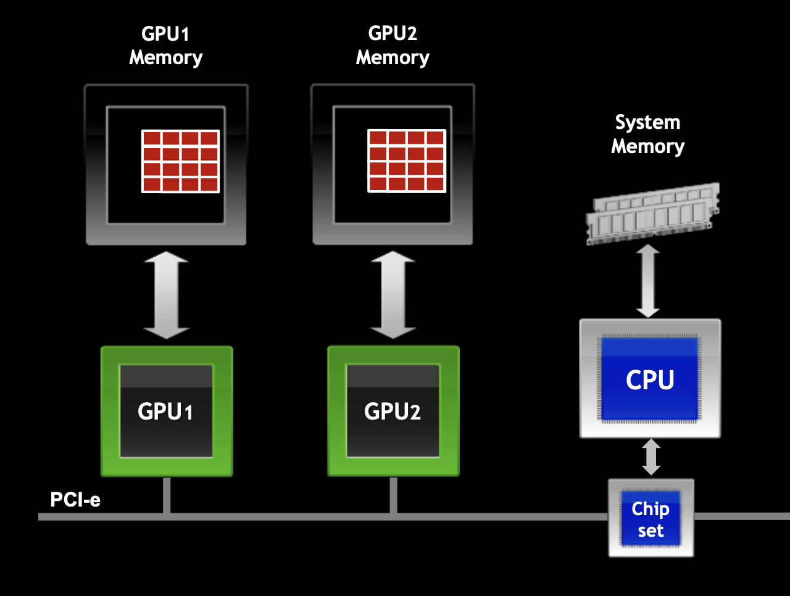

# Sample Codes using CUDA-AWARE MPI on Multi-GPU Environments

In most parallel applications it is necessary to carry out communication operations involving multiple computational resources. These communication operations can be implemented through point-to-point operations, however, this approach is not very efficient for the programmer. Parallel and distributed solutions based on collective operations have long been the main choice for these applications. The MPI standard has a set of very efficient routines that perform collective operations, making better use of the computing capacity of available computational resources. Also, with the advent of new computational resources, similar routines appear for multi-GPU systems. This repository will cover the handling of NCCL routines for multi-GPU environments, always comparing them with the MPI standard, showing the differences and similarities between the two computational execution environments.

 

      

     
  

----
## What is CUDA-AWARE MPI?
see [NVIDIA](https://developer.nvidia.com/blog/introduction-cuda-aware-mpi/)

> CUDA-Aware MPI is a implementation must handle buffers differently depending on whether it resides in host or device memory. An MPI implementation could offer different APIs for host and device buffers, or it could add an additional argument indicating where the passed buffer lives. MPI, the Message Passing Interface, is a standard API for communicating data via messages between distributed processes that is commonly used in HPC to build applications that can scale to multi-node computer clusters. As such, MPI is fully compatible with CUDA, which is designed for parallel computing on a single computer or node.
----

## Why Parallel Programming approaches of MPI and CUDA?

There are a number of reasons for wanting to combine the complementary parallel programming approaches of MPI and CUDA:

* To solve problems with a data size too large to fit into the memory of a single GPU;
* To solve problems that would require unreasonably long compute time on a single node;
* To accelerate an existing MPI application with GPUs;
* To enable a single-node multi-GPU application to scale across multiple nodes.

----

## Implementations Available for CUDA-AWARE MPI

CUDA-AWARE requires at least CUDA 7.0 and Kepler or newer GPUs. For NVLINK based platforms, best performance is achieved when all GPUs are located on a common PCIe root complex, but multi-socket configurations are also supported. There are several commercial and open-source CUDA-aware MPI implementations available:

* [MVAPICH2 1.8/1.9b](http://mvapich.cse.ohio-state.edu/)
* [OpenMPI 1.7 (beta)](http://www.open-mpi.org/)
